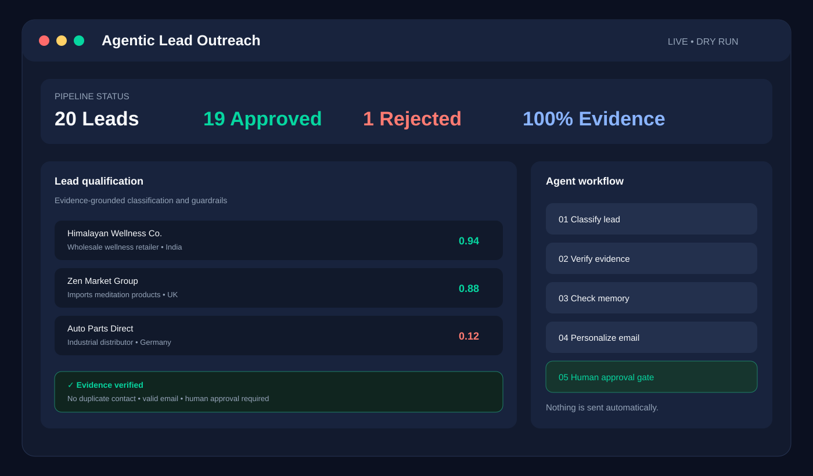
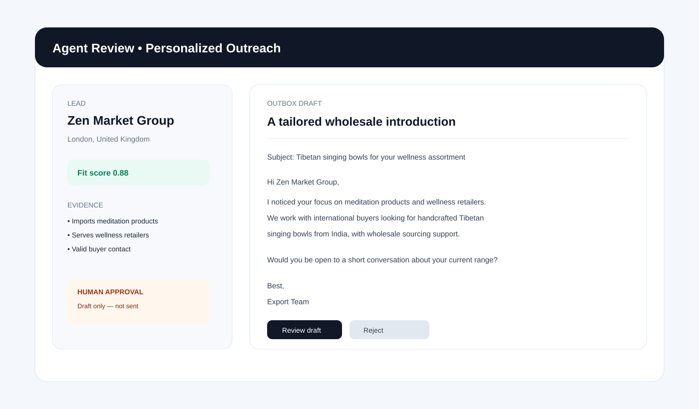
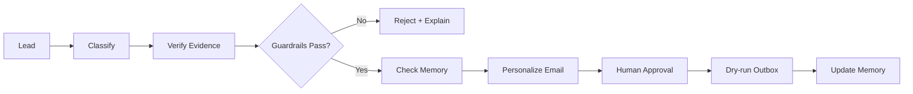

<div align="center">

# 🤖 Agentic B2B Lead Outreach

### Evidence-grounded lead qualification, personalization & safe outreach

<p>
  <strong>micro1 Agentic Workflows Hackathon</strong> · Python · Agentic AI · Claude-ready · Human-in-the-loop
</p>

<p>
  <a href="#-features">Features</a> ·
  <a href="#-architecture">Architecture</a> ·
  <a href="#-interface-preview">Interface</a> ·
  <a href="#-evaluation">Evaluation</a> ·
  <a href="#-quick-start">Quick Start</a>
</p>

</div>

---

## 🎯 What is this?

**Agentic B2B Lead Outreach** is an agentic workflow for an artisan exporter selling **Tibetan singing bowls** to international retailers, wellness stores, and sourcing companies.

Instead of blindly emailing every scraped lead, the workflow:

> **Classifies → verifies evidence → checks memory → personalizes → pauses for human approval**

The result is a safer outreach pipeline that is explainable, repeatable, and resistant to duplicate or poorly supported outreach.

## ✨ Why it matters

Traditional lead outreach has three recurring problems:

- 🔎 **Noisy discovery** — directories and web snippets contain many irrelevant companies.
- ✉️ **Generic outreach** — good leads often receive the same template.
- 🧠 **No memory** — the same buyer can accidentally be contacted twice.

This project treats those problems as an **agent workflow problem**, not simply a text-generation problem.

---

## 🚀 Features

| Feature | What it does |
|---|---|
| 🧩 Lead classification | Scores each lead using structured reasoning |
| 🔍 Evidence verification | Requires supporting evidence for strong-fit decisions |
| 🛡️ Guardrails | Rejects invalid emails, duplicates, weak fits, and unsupported high scores |
| 🧠 Persistent memory | Tracks contacted leads across runs |
| ✍️ Personalization | Drafts emails using lead-specific evidence |
| 👤 Human approval gate | Keeps real outreach under human control |
| 🧪 Baseline comparison | Measures the agent against a simpler baseline |
| 📴 Deterministic mock LLM | Runs end-to-end without an API key |
| ☁️ Claude-ready | Set `ANTHROPIC_API_KEY` to use real Claude calls |

---

## 🖥️ Interface Preview

The project is designed around a clean **lead-review / agent-workflow interface**. The visuals below illustrate the intended review experience and workflow state.

### Lead qualification dashboard



### Personalized outreach review



> **Safety by design:** the interface ends at a human approval step. The application does not automatically send real emails.

GitHub supports repository-hosted images and relative image paths in README files, so these visuals are version-controlled alongside the documentation. citeturn0search0turn0search1

---

## 🏗️ Architecture

```text
data/
├── leads.csv                  # 20 realistic synthetic B2B leads
└── eval_labels.json           # Evaluation ground truth

src/
├── llm.py                     # Mock / Claude LLM abstraction
├── baseline.py                # Simple baseline pipeline
├── agent.py                   # Agentic qualification + outreach
└── evaluate.py                # Evaluation runner

memory/
└── contacted.json             # Cross-run contact memory

outbox/
├── baseline/                  # Baseline draft emails
└── agent/                     # Agent-generated draft emails

trajectories/
├── agent/                     # Per-lead reasoning trajectories
└── *.json                     # Run summaries and evaluation reports

assets/
├── interface-overview.svg     # Dashboard visual
└── agent-email-review.svg     # Outreach review visual
```

### Agent workflow



### Why a single agent?

A multi-agent architecture was deliberately avoided. The task needs a clear sequence of decisions, evidence checks, memory, and an approval gate; adding several autonomous agents would increase complexity without improving the core workflow.

---

## 🧠 Guardrails

The strongest design choice is **not trusting a high model score by itself**.

A lead can be rejected when:

- the contact email is missing or invalid;
- the lead has already been contacted;
- the fit score is below the configured threshold;
- the model gives a high score but provides no supporting evidence.

That last rule catches the dangerous case of a confident-sounding classification with nothing concrete behind it.

---

## 📊 Evaluation

The same 20 leads are evaluated against the same hand-labeled ground truth.

| Metric | Baseline | Agent | Improvement |
|---|---:|---:|---:|
| Classification accuracy | 0.95 | **1.00** | **+0.05** |
| Precision | 0.917 | **1.00** | **+0.083** |
| Recall | 1.00 | **1.00** | — |
| Emails with lead-specific evidence | 0% | **100%** | **+100 pts** |
| False positives | 1 | **0** | **-1** |

Full machine-readable results are stored in `trajectories/evaluation_report.json`.

### ⏱️ Estimated human effort

For 20 leads, manual triage + writing is estimated at **25–35 minutes**. With the agent pipeline, the automated mock run completes in under a second, leaving approximately **2–3 minutes for final human review and approval**.

> The time figures are estimates, not benchmark measurements.

---

## ⚡ Quick Start

### Requirements

- Python **3.9+**
- No API key required for the default deterministic run

### 1. Clone

```bash
git clone https://github.com/Mohitrath/agentic-lead-outreach.git
cd agentic-lead-outreach
```

### 2. Install dependencies

```bash
pip install -r requirements.txt
```

### 3. Run the evaluation

```bash
cd src
python3 evaluate.py
```

### 4. Run individual pipelines

```bash
python3 baseline.py
python3 agent.py
```

Expected outputs include:

```text
trajectories/evaluation_report.json
trajectories/agent/*.json
trajectories/agent_run.json
outbox/baseline/*.txt
outbox/agent/*.txt
```

---

## ☁️ Use Real Claude Calls

The default configuration uses a deterministic mock model so anyone can reproduce the evaluation without spending API credits.

To use Claude instead:

```bash
export ANTHROPIC_API_KEY=your_key_here
python3 evaluate.py
```

Or create your local environment file from the template:

```bash
cp .env.example .env
```

**Never commit your real API key.**

---

## 🔄 Reset Memory

To start a fresh run:

```bash
echo '{"contacted_ids": []}' > memory/contacted.json
```

---

## 📬 Outreach Safety

This repository intentionally stops at a **dry-run / outbox**.

It does **not** automatically send real emails. A human must review and explicitly approve consequential outreach before anything is sent.

---

## 📁 Reproducibility

The project is structured so another developer can reproduce the evaluation locally:

1. Load the same 20 leads.
2. Run the baseline.
3. Run the agent.
4. Compare both against the evaluation labels.
5. Inspect the generated trajectories and email drafts.

The mock model makes this process deterministic and avoids dependency on an external API during grading.

---

## 💡 Key Insight

> **The most valuable guardrail was not a smarter prompt — it was rejecting a high score when the model could not provide evidence.**

For B2B outreach, a confident but unsupported classification can be more dangerous than a low score. Requiring evidence and mechanically validating it turns the agent from a simple text generator into a more reviewable decision-support workflow.

---

## 🛠️ Tech Stack

- **Python** — core implementation
- **Claude / Anthropic API** — optional real LLM backend
- **Structured JSON** — classifications, memory, trajectories, evaluation
- **CSV** — lead dataset
- **GitHub** — version control and reproducible project delivery

---

## 📌 Project Status

**Hackathon-ready · Reproducible · Human-in-the-loop · Dry-run only**

---

<div align="center">

### Built for reliable, evidence-grounded B2B outreach.

⭐ If this project helped you, consider starring the repository.

</div>
